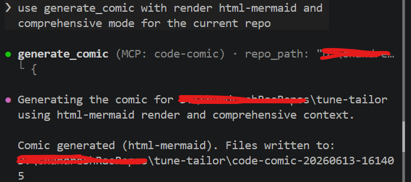

# code-comic

A Python CLI application that analyzes a GitHub repository architecture and generates a 4-scene comic explanation.

## What it does

- Analyze a local Git repository path
- Extract repository metadata and code structure
- Generate a 4-scene comic script using an LLM prompt (Gemini by default, with Hugging Face as optional secondary fallback)
- Render comics as HTML with Mermaid diagrams (`html-mermaid`, default) or generated PNG panels (`html-image`)
- Generate comic panel images via Hugging Face (`huggingface_hub`) by default, with Gemini as secondary fallback, and automatic `html-mermaid` fallback on image failure
- Expose the same pipeline over MCP (`analyze_repo`, `generate_comic`) for Copilot agents and CLI

## Setup

Before running the CLI or MCP tools, configure API keys in a `.env` file at the **code-comic** repo root.

1. Copy the example file:

   **Windows**

   ```powershell
   copy .env.example .env
   ```

   **macOS / Linux**

   ```bash
   cp .env.example .env
   ```

2. Add the keys you need:

   | Render mode | API keys |
   |-------------|----------|
   | `html-mermaid` (default) | `GEMINI_API_KEY` (or another LLM key you configure) |
   | `html-image` | `GEMINI_API_KEY` + `HF_TOKEN` recommended |

   Step-by-step key setup with links to [Google AI Studio](https://aistudio.google.com/app/apikey) and [Hugging Face Access Tokens](https://huggingface.co/settings/tokens): **[docs/SETUP.md](docs/SETUP.md)**.

   Optional overrides (`CODE_COMIC_LLM_MODELS`, `CODE_COMIC_IMAGE_MODELS`, provider inference, and more) are documented in `.env.example`.

## Limitations

`html-image` panel quality depends on the configured model chain (default: `black-forest-labs/FLUX.1-schnell` via Hugging Face, then Gemini). Free-tier Hugging Face inference may be slower or rate-limited; text rendered inside generated panels is best-effort (a known weakness of diffusion models at every tier). For consistent demos, use bundled [`examples/`](examples/) or default `html-mermaid` mode. Override models via `CODE_COMIC_IMAGE_MODELS` if you have access to other providers.

## Microsoft IQ integration (`requirement.md`)

This submission satisfies the **Microsoft IQ** evaluation criterion via **Foundry IQ** — agentic knowledge retrieval that grounds LLM outputs with cited enterprise sources. Work IQ and Fabric IQ are not used.

| Aspect | Status in this repo |
|--------|---------------------|
| IQ layer chosen | **Foundry IQ** — architecture-pattern knowledge base lookup before scene generation |
| Code integration | Optional client in `src/foundry_client.py`, wired in `src/renderer.py` when env vars are set |
| Submission demo | **Concept + code hook only** — bundled `examples/` comics and default CLI runs do **not** call a live Foundry IQ endpoint (no Azure knowledge base provisioned) |
| Why | Reduces hallucinated architecture claims by injecting retrieved, cited snippets into the comic prompt |

**How it works (when enabled):** before the LLM writes scene JSON, `ComicRenderer` builds a short repo query (path, top-level entries, languages), calls Foundry IQ, and inserts the result as synthetic content `__foundry_iq.txt` so `prompt_generator` includes grounded snippets in the prompt.

**Enable for your own Azure knowledge base** (optional; not required to run the demo):

```text
FOUNDRY_IQ_ENDPOINT=https://<your-search-service>.search.windows.net/knowledgebases('<kb-name>')/retrieve?api-version=2026-04-01
FOUNDRY_IQ_API_KEY=<your-search-api-key>
```

Optional: `FOUNDRY_IQ_TIMEOUT` (seconds, default `10`). If either endpoint or key is missing, the pipeline skips IQ and behaves as documented above.

Full design, Azure prerequisites, API notes, and honest scope: **[docs/FOUNDRY_IQ.md](docs/FOUNDRY_IQ.md)**.

## Install, run, and test

### Install dependencies

Using `uv` (recommended):

```bash
uv sync
```

Or with a virtual environment:

```bash
python -m venv .venv
```

**Windows (PowerShell)**

```powershell
.\.venv\Scripts\activate
pip install -r requirements.txt
```

**macOS / Linux**

```bash
source .venv/bin/activate
pip install -r requirements.txt
```

### Generate a comic

```bash
python cli.py path/to/repo
```

Optional arguments:

- `--output-dir` — directory to write outputs (default: `output`)
- `--render-mode` — `html-mermaid` (Mermaid diagram comic in `{repo-name}-comic.html`, no image API calls) or `html-image` (PNG panels in `images/`; auto-fallback to `html-mermaid` on image failure). Default: `html-mermaid`
- `--context-mode` — `lightweight` (README + docs, minimal tokens) or `comprehensive` (full repo analysis)
- `--debug` — print debug details and re-raise exceptions

For lowest token usage:

```bash
python cli.py path/to/repo --context-mode lightweight --render-mode html-mermaid
```

### Output artifacts

The CLI writes:

- `repo_metadata.json`, `comic_scenes.json`
- `prompt-1.txt` through `prompt-4.txt`
- `{repo-name}-comic.html` (both render modes)
- `panel-1.mmd` through `panel-4.mmd` (`html-mermaid` only)
- `images/panel-1.png` through `images/panel-4.png` (`html-image` when image APIs succeed)

Smoke-test with the bundled fixture:

```bash
python cli.py tests/fixtures/sample-repo --output-dir output/sample-test
```

### Run tests

```bash
pytest tests
```

Optional live image test (requires `HF_TOKEN` and/or `GEMINI_API_KEY` in `.env`):

```bash
# Windows
set CODE_COMIC_RUN_LIVE=1
pytest tests/test_sample_repo.py::test_live_image_generation_from_sample_repo -v

# macOS / Linux
CODE_COMIC_RUN_LIVE=1 pytest tests/test_sample_repo.py::test_live_image_generation_from_sample_repo -v
```

## Use MCP in another repo

The MCP server exposes `analyze_repo` and `generate_comic` — the same code paths as `cli.py`. Install **code-comic** once, register the server in Copilot (VS Code `.vscode/mcp.json` or Copilot CLI), then pass `repo_path` to any local Git repository you want to analyze.

**Typical Copilot CLI prompt** (from the target repo or with `repo_path` set):

```
Use generate_comic with render_mode=html-mermaid and context_mode=comprehensive for the current repo.
```

Terminal capture from a real run against **TuneTailor** (output written to `code-comic-20260613-161405/` in that repo):



Full setup for VS Code Copilot Agent, Copilot CLI, user-profile config, and tool parameters: **[docs/MCP_SETUP.md](docs/MCP_SETUP.md)**.

Development notes on how Copilot helped build and validate the project: **[docs/COPILOT_USAGE.md](docs/COPILOT_USAGE.md)**.

## Examples

Pre-generated comic outputs are included so you can preview results before running the CLI yourself. Open the HTML files in a browser.

The **TuneTailor** and **Vishwakarma** examples below were produced by pointing Copilot CLI at those repositories with `generate_comic` (see screenshot above). The **code-comic** self-demo can be reproduced locally with `python cli.py .` or via MCP on `.`.

### This repo explains itself (`code-comic`)

The project was run against **its own source** — a self-referential demo that walks through `cli.py`, MCP tools, and the docs folder.

| Render mode | Comic HTML | Notes |
|-------------|------------|-------|
| `html-mermaid` | [`examples/code-comic/html-mermaid/code-comic-comic.html`](examples/code-comic/html-mermaid/code-comic-comic.html) | Mermaid diagrams; references `docs/SETUP.md`, `cli.py`, MCP |
| `html-image` | [`examples/code-comic/html-image/code-comic-comic.html`](examples/code-comic/html-image/code-comic-comic.html) | AI-generated PNG panels in `images/` |

Reproduce from the repo root:

```bash
python cli.py . --render-mode html-mermaid --context-mode lightweight
python cli.py . --render-mode html-image --context-mode comprehensive
```

### Other repositories

| Repository | Render mode | Comic HTML |
|------------|-------------|------------|
| **TuneTailor** — local music assistant with Gemini intent mapping | `html-mermaid` | [`examples/tune-tailor/html-mermaid/comic.html`](examples/tune-tailor/html-mermaid/comic.html) |
| **TuneTailor** | `html-image` (AI PNG panels) | [`examples/tune-tailor/html-image/tune-tailor-comic.html`](examples/tune-tailor/html-image/tune-tailor-comic.html) |
| **Vishwakarma** — zero-cost school CMS (React + Python sync) | `html-mermaid` | [`examples/vishwakarma/html-mermaid/vishwakarma-comic.html`](examples/vishwakarma/html-mermaid/vishwakarma-comic.html) |
| **Vishwakarma** | `html-image` (AI PNG panels) | [`examples/vishwakarma/html-image/vishwakarma-comic.html`](examples/vishwakarma/html-image/vishwakarma-comic.html) |

Each example folder contains the full artifact set: `comic_scenes.json`, `repo_metadata.json`, `prompt-*.txt`, and (for Mermaid mode) `panel-*.mmd` or (for image mode) `images/panel-*.png`.
