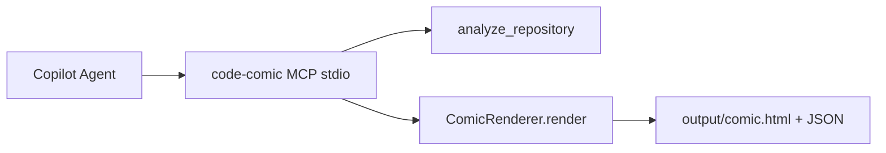

# code-comic MCP + Copilot Plan (copy-paste for Copilot)

Give Copilot this plan in **Agent mode**. Implement **Phase 1 first**, then **Phase 2**. Do not refactor existing CLI/renderer logic — wrap it.

---

## Current baseline (do not rewrite)

Reuse these existing pieces:

- [`src/renderer.py`](src/renderer.py) — `ComicRenderer.render(repo_path)` returns `{output_dir, scenes, html_file, render_mode_used, fallback, ...}`
- [`src/analyzer.py`](src/analyzer.py) — `analyze_repository(repo_path, context_mode=...)`
- [`src/config.py`](src/config.py) — `Config.from_env(...)` with `render_mode`, `context_mode`, dotenv auto-load
- [`cli.py`](cli.py) — already supports `--render-mode image|html|text` and `--context-mode lightweight|comprehensive`
- Fixture for smoke tests: [`tests/fixtures/sample-repo/`](tests/fixtures/sample-repo/)



---

## Phase 1 — Submission docs + Foundry IQ scaffold (no MCP code yet)

### 1.1 Add `docs/COPILOT_USAGE.md`

Document **how Copilot helped build the project** (requirement #1). Include 5–8 concrete bullets tied to files, e.g.:

- `src/ignore_handler.py` — glob / `.code-comic-ignore` logic
- `src/html_renderer.py` — Mermaid HTML comic layout
- `tests/test_renderer.py` — fake LLM/image client patterns
- MCP server (Phase 2) — FastMCP boilerplate

Keep it honest and file-specific; judges want process, not quota usage.

### 1.2 Add `docs/FOUNDRY_IQ.md` (scaffold only)

Lean Foundry IQ setup for requirement #2 — **document the path**, do not block on Azure deployment:

- Link to [microsoft/iq-series](https://github.com/microsoft/iq-series) pattern
- Describe a KB containing: software architecture patterns + example comic scene structures
- Show placeholder `.vscode/mcp.json` **comment** for a future `foundry-iq` server (Search endpoint + admin key via MCP inputs)
- Demo prompt: *"Use Foundry IQ to find architecture patterns for this repo, then generate a comic with code-comic."*

No Azure resources required in Phase 1 — just the doc + commented config stub.

### 1.3 README touch-up

Add a short **"GitHub Copilot"** section to [`README.md`](README.md) pointing to `docs/COPILOT_USAGE.md` and noting Phase 2 MCP usage (link anchor once MCP exists).

---

## Phase 2 — Lean MCP server (secondary deliverable)

### 2.1 Dependency + entry point

In [`pyproject.toml`](pyproject.toml):

- Add `"mcp[cli]>=1.0"` to `dependencies`
- Add script: `code-comic-mcp = "src.mcp_server:main"`

Run `uv sync` after editing.

### 2.2 Create [`src/mcp_server.py`](src/mcp_server.py)

Use **FastMCP** from the official Python SDK:

```python
from mcp.server.fastmcp import FastMCP
```

**Two tools only** (keep lean):

| Tool | Args | Behavior |
|------|------|----------|
| `analyze_repo` | `repo_path: str \| None`, `context_mode: str = "lightweight"` | Call `analyze_repository()`. Return JSON metadata dict. Mark read-only in docstring. |
| `generate_comic` | `repo_path: str \| None`, `context_mode: str = "lightweight"`, `render_mode: str = "html"`, `output_dir: str = "output"` | Build `Config.from_env(...)`, instantiate `ComicRenderer`, call `render()`. Return summary JSON: `output_dir`, `render_mode_used`, `fallback`, scene titles/descriptions, `html_file` path if present. |

**Repo path resolution** (for any open workspace):

```python
def _resolve_repo_path(repo_path: str | None) -> str:
    return repo_path or os.environ.get("CODE_COMIC_REPO_PATH") or os.getcwd()
```

**Defaults tuned for free tier / low cost:**

- `context_mode="lightweight"` (already minimizes tokens)
- `render_mode="html"` (no HF/Gemini image API calls; produces `comic.html`)

**Error handling:** catch exceptions, return `{"error": str(exc)}` with non-zero semantics via raised `ValueError` or structured error field — pick one pattern and stay consistent.

**Do not** duplicate prompt/LLM logic in MCP — only call existing modules.

### 2.3 VS Code MCP config

Create [`.vscode/mcp.json`](.vscode/mcp.json):

```json
{
  "inputs": [
    {
      "type": "promptString",
      "id": "code-comic-root",
      "description": "Absolute path to code-comic install (for user-profile config when using other repos)",
      "default": "${workspaceFolder}"
    }
  ],
  "servers": {
    "code-comic": {
      "type": "stdio",
      "command": "uv",
      "args": ["run", "--directory", "${input:code-comic-root}", "code-comic-mcp"]
    }
  }
}
```

Add **`docs/MCP_SETUP.md`** with two install modes:

1. **This repo (demo):** open code-comic, start MCP from `.vscode/mcp.json`, use fixture: *"Generate an HTML comic for tests/fixtures/sample-repo"*
2. **Any other repo:** user-profile MCP config (`MCP: Open User Configuration`) pointing `--directory` to the fixed code-comic clone path; pass target repo via `repo_path` tool arg or set `CODE_COMIC_REPO_PATH=${workspaceFolder}` in env

### 2.4 Tests — [`tests/test_mcp_server.py`](tests/test_mcp_server.py)

Follow existing fake-client pattern from [`tests/test_renderer.py`](tests/test_renderer.py):

- Mock `ComicRenderer.render` and `analyze_repository`
- Test `_resolve_repo_path` precedence (arg > env > cwd)
- Test `generate_comic` returns expected JSON keys
- No live MCP subprocess or API calls

### 2.5 README final section

Add **"Use with GitHub Copilot (MCP)"** to [`README.md`](README.md):

1. VS Code 1.99+, Copilot Agent mode
2. Start `code-comic` MCP server, enable tools
3. Example prompt:

   > Use code-comic to generate an HTML architecture comic for this workspace. Use lightweight context mode.

4. Link to `docs/MCP_SETUP.md` and `docs/COPILOT_USAGE.md`

---

## Out of scope (do not implement now)

- HTTP/streamable MCP transport or GitHub cloud-agent hosting
- PyPI publish / `uvx` distribution
- Foundry IQ Azure deployment (Phase 1 doc only)
- More than 2 MCP tools, resources, or prompts
- Refactoring `ComicRenderer`, `cli.py`, or image pipeline

---

## Verification checklist (run after Phase 2)

```bash
uv sync
pytest tests/test_mcp_server.py -v
pytest tests/test_renderer.py -v
python cli.py tests/fixtures/sample-repo --render-mode html --output-dir output/mcp-smoke
```

Manual: VS Code → Copilot Agent → enable `code-comic` tools → ask for HTML comic on `tests/fixtures/sample-repo` → confirm `output/comic.html` created.

---

## Suggested Copilot kickoff prompt

Paste this into Copilot Agent after opening the code-comic repo:

> Implement the two-phase plan in `docs/` (create if missing). Phase 1: add `docs/COPILOT_USAGE.md`, `docs/FOUNDRY_IQ.md` scaffold, README Copilot section. Phase 2: add `mcp[cli]` dep, create `src/mcp_server.py` with `analyze_repo` and `generate_comic` tools wrapping existing `analyze_repository` and `ComicRenderer`, add `.vscode/mcp.json`, `docs/MCP_SETUP.md`, `tests/test_mcp_server.py`, and README MCP section. Default MCP render_mode to `html`. Do not refactor renderer/cli. Run pytest when done.
